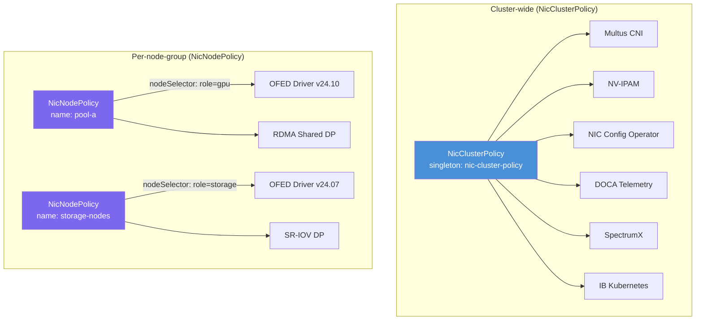
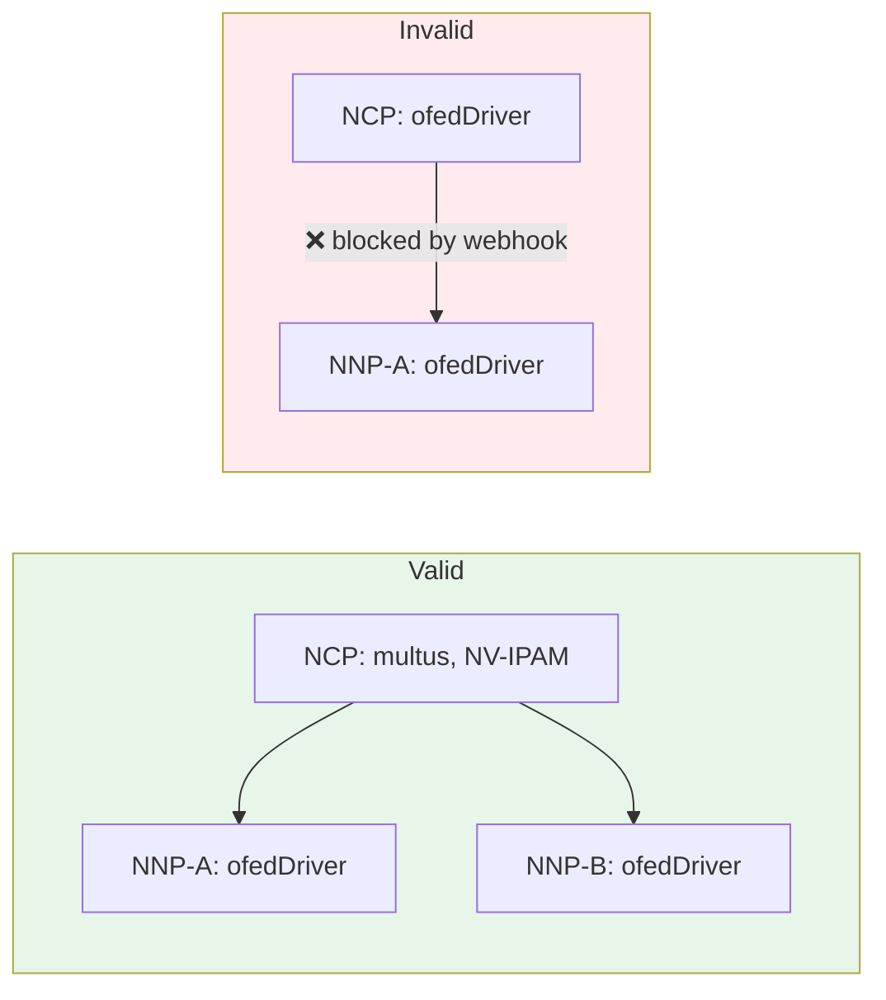
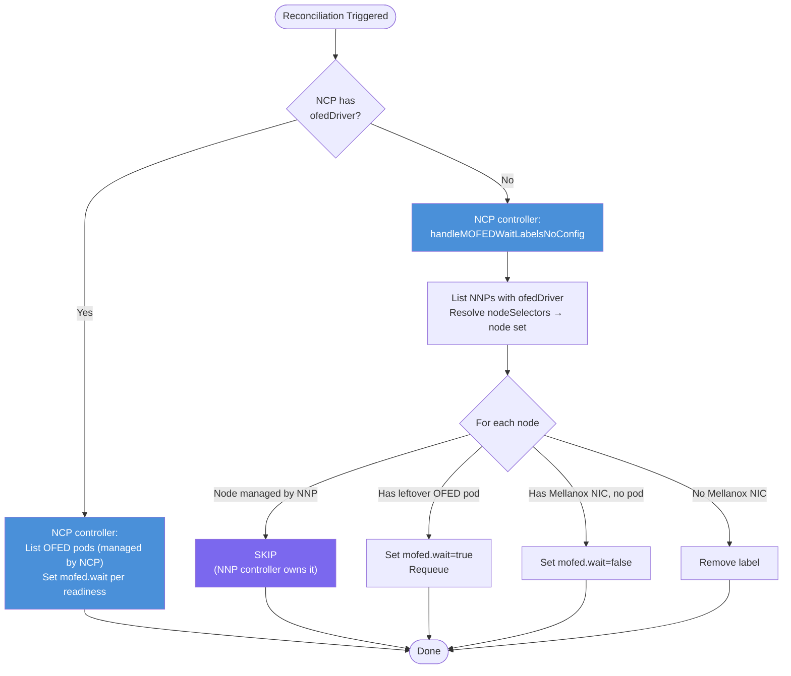
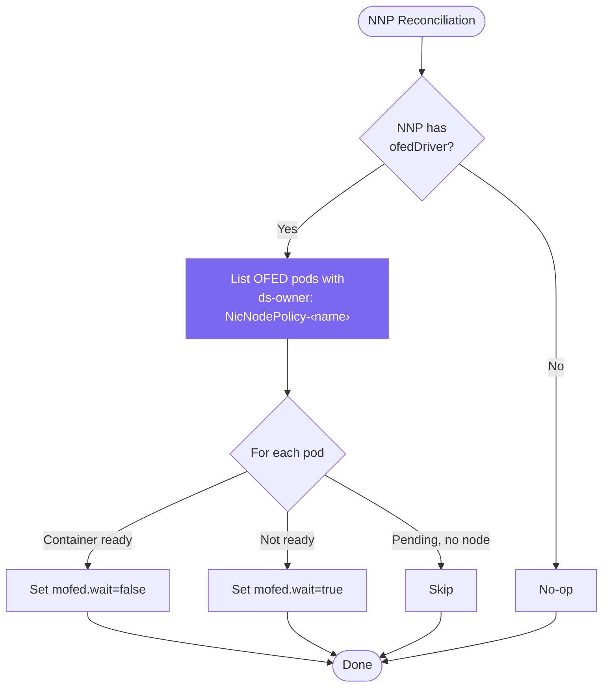
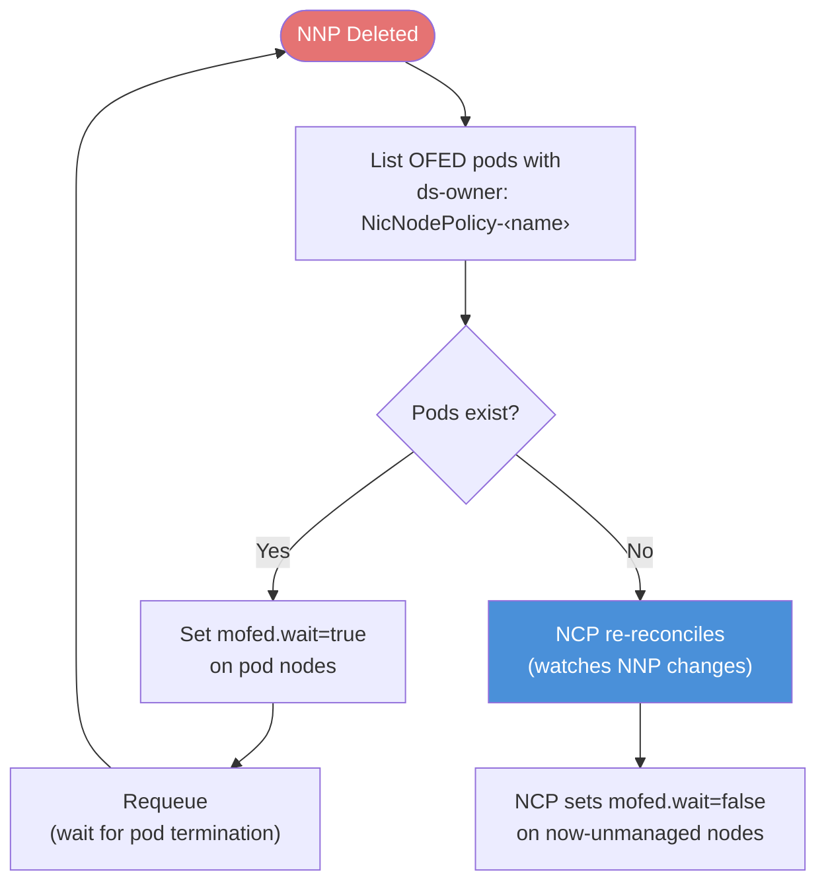
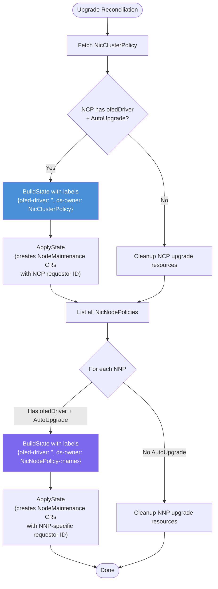

# Heterogeneous Cluster Support

This document describes how the Network Operator supports heterogeneous clusters — clusters where different groups of nodes require different DOCA/OFED driver versions or device plugin configurations.

## Overview

The Network Operator provides two CRDs for managing NIC components:

- **NicClusterPolicy (NCP)** — a singleton resource that applies configuration cluster-wide
- **NicNodePolicy (NNP)** — per-node-group resources that target specific nodes via `nodeSelector`

NNP supports a subset of components: OFED driver, RDMA shared device plugin, and SR-IOV device plugin. Cluster-wide components (CNI plugins, multus, NV-IPAM, etc.) remain in NCP.

## Architecture

### CRD Interaction



### Section Exclusivity

A given section (ofedDriver, rdmaSharedDevicePlugin, sriovDevicePlugin) can exist in **either** NCP or NNPs, but not both simultaneously. This is enforced at admission time by the validating webhook and prevents conflicting configurations.



### Node Selector Overlap Prevention

Two NicNodePolicies must not select overlapping sets of nodes. This is validated:

1. **At admission time** — the webhook lists actual cluster nodes and checks for intersection
2. **At runtime** — the NNP controller re-checks on every reconciliation to catch node re-labeling. If overlap is detected, the CR status is set to `Error` with a description of which nodes overlap, and no DaemonSet changes are applied until the overlap is resolved.

## DaemonSet Naming and Ownership

Each NNP produces uniquely-named DaemonSets by appending the policy name as a suffix:

| Policy | DaemonSet Name |
|--------|---------------|
| NicClusterPolicy | `mofed-ubuntu22.04-<hash>-ds` |
| NicNodePolicy `pool-a` | `mofed-ubuntu22.04-<hash>-pool-a-ds` |

The `ds-owner` label (on both DaemonSet and pod template) tracks which policy owns each resource:
- NCP: `ds-owner: NicClusterPolicy`
- NNP: `ds-owner: NicNodePolicy-<name>`

## OFED Wait Label (`mofed.wait`)

Several downstream DaemonSets (RDMA DP, SR-IOV DP, DOCA telemetry, NIC configuration daemon) use `network.nvidia.com/operator.mofed.wait: "false"` as a nodeSelector. This label gates their scheduling until the OFED driver is ready on a node.

### Label Management Flow





### NNP Deletion Flow



## DOCA Driver Upgrade

The `UpgradeReconciler` manages OFED driver upgrades. Two modes are supported:

- **Maintenance-operator mode** (recommended): Upgrades are coordinated via `NodeMaintenance` CRs, with each policy using an isolated requestor ID.
- **Legacy mode**: The upgrade controller directly cordons, drains, and restarts pods without creating `NodeMaintenance` objects.

Both modes work with NicNodePolicy. Each policy gets its own upgrade state manager.

### Upgrade Flow



### Per-Policy Upgrade Isolation

Each NicNodePolicy upgrade is independent:

- **Separate state managers** — keyed by `NicNodePolicy-<name>`
- **Separate requestor IDs** — `<base-requestor-id>-NicNodePolicy-<name>`
- **Scoped DaemonSet selection** — `BuildState` filters by `ds-owner` label so each policy only sees its own DaemonSets
- **Independent NodeMaintenance CRs** — the maintenance-operator handles each policy's cordon/drain independently

This means upgrading OFED on GPU nodes does not affect storage nodes, and vice versa.

### NCP Upgrade Cleanup Scoping

When NCP has no `ofedDriver` or `autoUpgrade` is disabled, the upgrade controller runs cleanup to remove upgrade state labels and NodeMaintenance objects. This cleanup is **scoped** — it skips nodes managed by NicNodePolicies with active OFED configurations, ensuring NCP cleanup does not disrupt in-progress NNP upgrades.

## Example: Mixed Cluster

```yaml
# Cluster-wide components
apiVersion: mellanox.com/v1alpha1
kind: NicClusterPolicy
metadata:
  name: nic-cluster-policy
spec:
  multus: { ... }
  nvIpam: { ... }
  nicConfigurationOperator: { ... }
---
# GPU nodes: DOCA 24.10 with RDMA
apiVersion: mellanox.com/v1alpha1
kind: NicNodePolicy
metadata:
  name: pool-a
spec:
  nodeSelector:
    node-role.kubernetes.io/gpu: ""
  ofedDriver:
    image: doca-driver
    repository: nvcr.io/nvidia/mellanox
    version: "24.10-0.7.0.0-0"
    ofedUpgradePolicy:
      autoUpgrade: true
      maxParallelUpgrades: 1
  rdmaSharedDevicePlugin:
    image: k8s-rdma-shared-dev-plugin
    repository: nvcr.io/nvidia/cloud-native
    version: "v1.5.1"
    config: |
      { "periodicUpdateInterval": 300,
        "configList": [{ "resourceName": "rdma_shared_device_a",
                         "rdmaHcaMax": 63 }] }
---
# Storage nodes: DOCA 24.07 with SR-IOV
apiVersion: mellanox.com/v1alpha1
kind: NicNodePolicy
metadata:
  name: storage-nodes
spec:
  nodeSelector:
    node-role.kubernetes.io/storage: ""
  ofedDriver:
    image: doca-driver
    repository: nvcr.io/nvidia/mellanox
    version: "24.07-0.6.1.0-0"
    ofedUpgradePolicy:
      autoUpgrade: true
      maxParallelUpgrades: 2
  sriovDevicePlugin:
    image: sriov-network-device-plugin
    repository: ghcr.io/k8snetworkplumbingwg
    version: "v3.7.0"
    config: |
      { "resourceList": [{ "resourceName": "sriov_rdma",
                           "selectors": { "vendors": ["15b3"] } }] }
```

## Key Files

| File | Purpose |
|------|---------|
| `api/v1alpha1/nicnodepolicy_types.go` | NicNodePolicy CRD types |
| `api/v1alpha1/nic_policy_cr.go` | Shared `NicPolicyCR` interface |
| `controllers/nicnodepolicy_controller.go` | NNP reconciler |
| `controllers/mofed_wait_labels.go` | Shared mofed.wait label helpers |
| `controllers/nic_policy_helpers.go` | Shared controller utilities |
| `controllers/upgrade_controller.go` | Per-policy OFED upgrade |
| `pkg/policyoverlap/overlap.go` | Section conflict + node overlap detection |
| `api/v1alpha1/validator/nicpolicy_webhook.go` | Admission validation |
| `pkg/state/factory.go` | State factory routing by CRD name |
