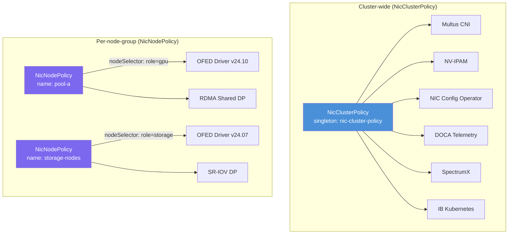
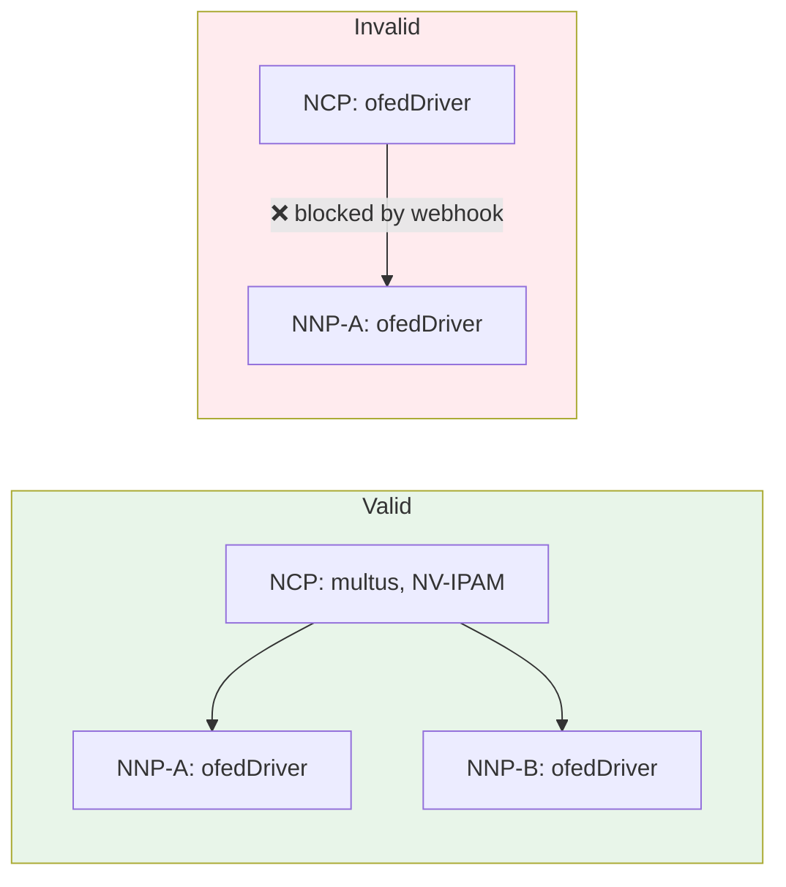
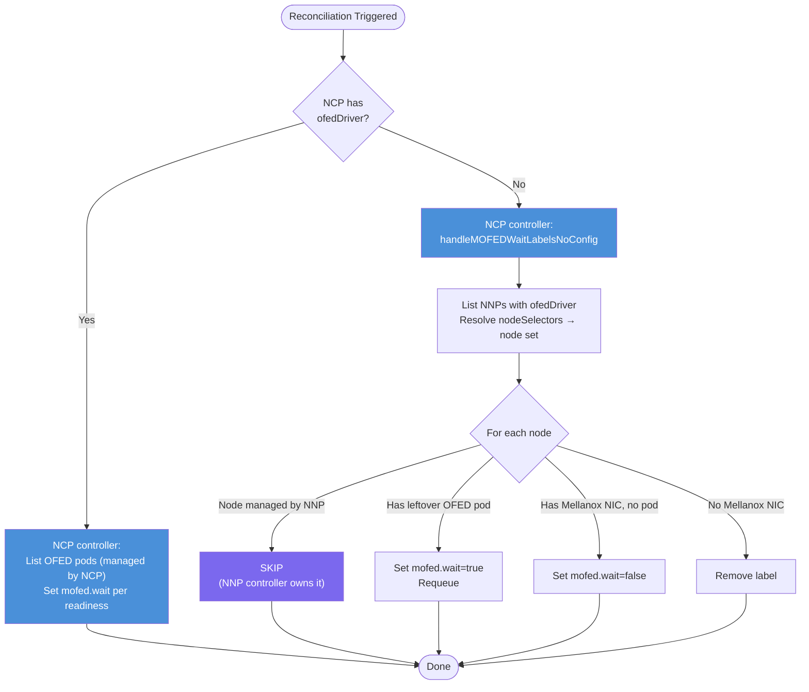
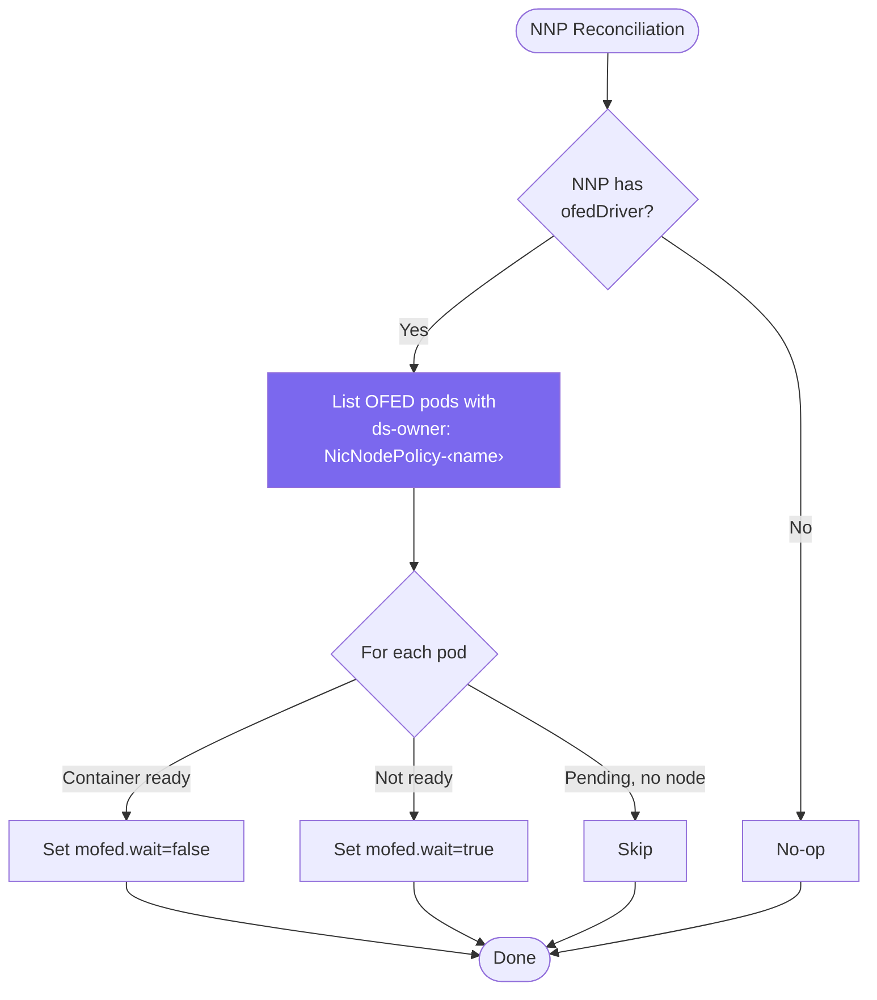
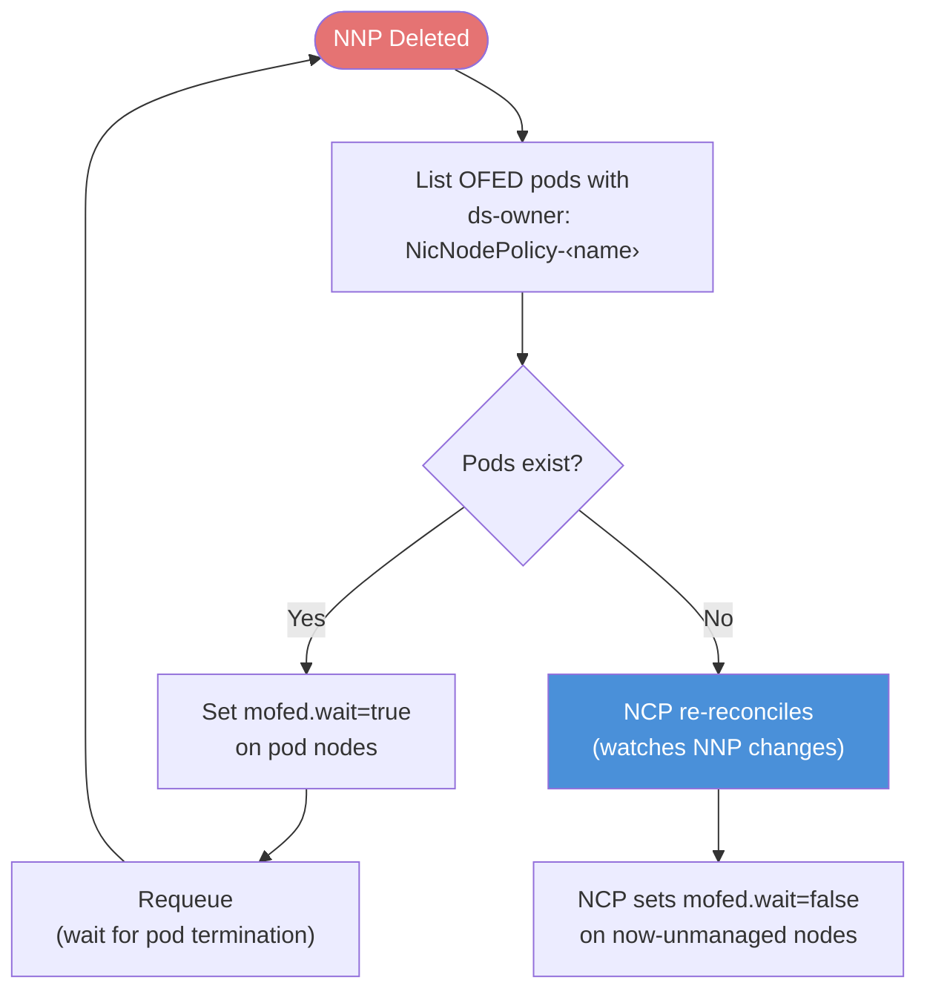
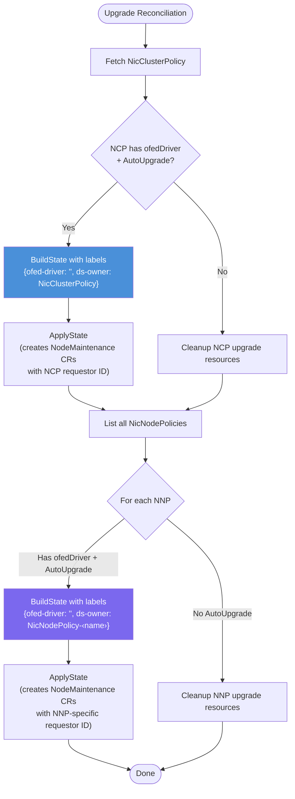

# Heterogeneous Cluster Support

This document describes how the Network Operator supports heterogeneous clusters — clusters where different groups of nodes require different DOCA/OFED driver versions or device plugin configurations.

## Overview

The Network Operator provides two CRDs for managing NIC components:

- **NicClusterPolicy (NCP)** — a singleton resource that applies configuration cluster-wide
- **NicNodePolicy (NNP)** — per-node-group resources that target specific nodes via `nodeSelector`

NNP supports a subset of components: OFED driver, RDMA shared device plugin, and SR-IOV device plugin. Cluster-wide components (CNI plugins, multus, NV-IPAM, etc.) remain in NCP.

## Architecture

### CRD Interaction


```mermaid
flowchart TB
    subgraph "Cluster-wide (NicClusterPolicy)"
        NCP[NicClusterPolicy<br/>singleton: nic-cluster-policy]
        NCP --> Multus[Multus CNI]
        NCP --> NVIPAM[NV-IPAM]
        NCP --> NicConfig[NIC Config Operator]
        NCP --> DocaTelemetry[DOCA Telemetry]
        NCP --> SpectrumX[SpectrumX]
        NCP --> IBK8s[IB Kubernetes]
    end

    subgraph "Per-node-group (NicNodePolicy)"
        NNP1[NicNodePolicy<br/>name: pool-a]
        NNP2[NicNodePolicy<br/>name: storage-nodes]
        NNP1 -->|nodeSelector: role=gpu| OFED1[OFED Driver v24.10]
        NNP1 --> RDMA1[RDMA Shared DP]
        NNP2 -->|nodeSelector: role=storage| OFED2[OFED Driver v24.07]
        NNP2 --> SRIOV2[SR-IOV DP]
    end

    style NCP fill:#4a90d9,color:white
    style NNP1 fill:#7b68ee,color:white
    style NNP2 fill:#7b68ee,color:white
```

### Section Exclusivity

A given section (ofedDriver, rdmaSharedDevicePlugin, sriovDevicePlugin) can exist in **either** NCP or NNPs, but not both simultaneously. This is enforced at admission time by the validating webhook and prevents conflicting configurations.


```mermaid
flowchart LR
    subgraph Valid
        direction TB
        V1[NCP: multus, NV-IPAM] --> V2[NNP-A: ofedDriver]
        V1 --> V3[NNP-B: ofedDriver]
    end

    subgraph Invalid
        direction TB
        I1[NCP: ofedDriver] -->|"❌ blocked by webhook"| I2[NNP-A: ofedDriver]
    end

    style Valid fill:#e8f5e9
    style Invalid fill:#ffebee
```

### Node Selector Overlap Prevention

Two NicNodePolicies must not select overlapping sets of nodes. This is validated:

1. **At admission time** — the webhook lists actual cluster nodes and checks for intersection
2. **At runtime** — the NNP controller re-checks on every reconciliation to catch node re-labeling. If overlap is detected, the CR status is set to `Error` with a description of which nodes overlap, and no DaemonSet changes are applied until the overlap is resolved.

## DaemonSet Naming and Ownership

NicClusterPolicy keeps the existing DaemonSet names. All three NicNodePolicy
components append the same short, deterministic policy-name hash:

| Component | NicClusterPolicy | NicNodePolicy |
|-----------|------------------|---------------|
| OFED | `mofed-ubuntu22.04-<kernel-hash>-ds` | `mofed-ubuntu22.04-<kernel-hash>-<policy-name-hash>-ds` |
| RDMA shared device plugin | `rdma-shared-dp-ds` | `rdma-shared-dp-ds-<policy-name-hash>` |
| SR-IOV device plugin | `network-operator-sriov-device-plugin` | `network-operator-sriov-device-plugin-<policy-name-hash>` |

The policy-name hash uses the same mechanism as the OFED kernel hash. Only
DaemonSet identity is hashed: policy-specific ConfigMap names and the RDMA
shared device plugin `app` label retain the readable policy-name suffix.

The `ds-owner` label (on both DaemonSet and pod template) tracks which policy owns each resource:
- NCP: `ds-owner: NicClusterPolicy`
- NNP: `ds-owner: NicNodePolicy-<name>`

## Node Pool Disappearance and Deferred Cleanup

One OFED DaemonSet is rendered per node pool, where a pool is the set of nodes sharing an OS and kernel version. Pool membership is derived from NFD labels every reconciliation, so a pool has no eligible nodes whenever its nodes are temporarily invisible to the operator — NFD labels briefly missing after a reboot, an untolerated taint, or an API server blip. A pool with no nodes renders no DaemonSet, and without special handling the ordinary stale-object cleanup would read that as "no longer wanted" and delete a DaemonSet whose workload is still running and still needed.

The operator therefore never deletes an OFED DaemonSet solely because its pool is empty:

- The pool a DaemonSet belongs to is recomputed from the DaemonSet's own `nodeSelector` (the OS name, OS version, and kernel-version NFD labels), so the check works for DaemonSets rendered by earlier operator versions and needs no stored state.
- When a DaemonSet is not rendered and its pool is empty, the DaemonSet is kept and annotated with `network.nvidia.com/stale-since`, an RFC3339 UTC timestamp of when it was first observed this way. The annotation lives on the object so the deferral survives operator restarts and leader-election handovers. The shared ServiceAccount, RBAC objects, and init container ConfigMap are kept alongside it so the retained pods can restart.
- If the pool comes back, the annotation is removed on the next reconciliation and the deferral is canceled.
- If the pool is still empty 20 minutes after the first observation, the pool is treated as genuinely retired and the DaemonSet is deleted. The grace period is a build-time constant (`staleOFEDGracePeriod`).
- Deletion that follows from intent is unaffected: removing `ofedDriver` from a policy or deleting the policy deletes the DaemonSet immediately, whether or not the pool has nodes. The deferral only ever applies to a DaemonSet the operator stopped rendering because pool discovery came up empty.
- Retargeting a `NicNodePolicy` is intent too, and is also exempt. A rendered `nodeSelector` is the policy's own `nodeSelector` laid over the NFD pool labels, so a DaemonSet whose `nodeSelector` no longer covers everything the policy currently asks for was built for different nodes, and it is deleted at once rather than deferred. Holding it would keep its pod on a node for the whole grace period, and because the driver pods are mutually anti-affine per node, a policy that has taken that node over could not start there until the deferral expired. The pool labels are not reserved — a policy is free to select on them, and entries it sets count as the policy's own. Widening a `nodeSelector` is not retargeting, since every node matched before is matched still. Node *labels* changing is not intent either: a label disappearing is indistinguishable from the transient label loss this mechanism exists to absorb, whereas a policy edit is unambiguous.

A driver version change is applied in place, because a DaemonSet is named after its pool and not after the version. While the pool has nodes the new version is written to the DaemonSet on the next reconciliation, as before. While the pool has none, there is no rendered DaemonSet to carry the new version, and deleting the old one would take the driver away from nodes that are still running it — the failure this mechanism exists to prevent. The upgrade therefore waits and is applied the moment the pool reappears; if the pool never does, the DaemonSet is reaped with it at the end of the grace period.

A pending deadline produces no cluster event when it passes, so the OFED state reports the remaining delay up through the state manager and both policy controllers schedule a `RequeueAfter` for it — including on an otherwise ready reconciliation, where nothing else would bring the policy back.

### Tolerations and Pool Eligibility

A node only joins a pool if the driver pod tolerates its taints, so the eligibility filter and the rendered pod have to agree: a filter stricter than scheduling drops nodes that would have run the driver, and a filter looser than scheduling hands the pod a node it can never be placed on. Both are therefore derived from one list in `state_ofed.go`:

- `driverPodTolerations` — the tolerations rendered into the pod template: whatever `tolerations` the policy sets, plus `nvidia.com/gpu:NoSchedule` and the `NoSchedule` halves of `node.kubernetes.io/not-ready` and `node.kubernetes.io/unreachable`. The last two matter because the driver is part of what makes a node ready, and its own `openibd` restart can flip the node `NotReady` for a moment; the DaemonSet controller tolerates only the `NoExecute` halves, which protects a running pod but would leave a restarting one unschedulable exactly when it is needed.
- `schedulableNodeTolerations` — what pool eligibility is judged against: `driverPodTolerations` plus the tolerations the DaemonSet controller injects at admission (the `NoExecute` not-ready/unreachable pair and the pressure/unschedulable/network-unavailable taints).

Because the second is derived from the first, the filter cannot drift into claiming a node the pod would not be scheduled onto. Anything added to the pod's tolerations must go through `driverPodTolerations` rather than into the DaemonSet manifest directly.

## OFED Wait Label (`mofed.wait`)

Several downstream DaemonSets (RDMA DP, SR-IOV DP, DOCA telemetry, NIC configuration daemon) use `network.nvidia.com/operator.mofed.wait: "false"` as a nodeSelector. This label gates their scheduling until the OFED driver is ready on a node.

### Graceful Node Shutdown

The controller updates `mofed.wait` when MOFED pods become unready. On node reboot or shutdown this only works if the controller is still running while MOFED starts terminating.

To support that, the Network Operator controller Deployment uses:

- `priorityClassName: system-node-critical` (same critical graceful-shutdown phase as MOFED)
- a `preStop` sleep (default 25s) so the manager keeps reconciling while MOFED begins termination
- `terminationGracePeriodSeconds` greater than the sleep (default 30s)

This depends on Kubernetes [Graceful Node Shutdown](https://kubernetes.io/docs/concepts/cluster-administration/node-shutdown/) being enabled on the cluster. Configure the kubelet with non-zero values, for example:

```yaml
shutdownGracePeriod: 90s
shutdownGracePeriodCriticalPods: 60s
```

Without those kubelet settings, the priority class and `preStop` sleep have no effect during node shutdown. Helm users can tune `operator.priorityClassName`, `operator.preStopSleepSeconds`, and `operator.terminationGracePeriodSeconds`.

### Label Management Flow


```mermaid
flowchart TD
    Start([Reconciliation Triggered])
    Start --> CheckNCP{NCP has<br/>ofedDriver?}

    CheckNCP -->|Yes| NCPManage["NCP controller:<br/>List OFED pods (managed by NCP)<br/>Set mofed.wait per readiness"]
    NCPManage --> Done([Done])

    CheckNCP -->|No| NCPFallback["NCP controller:<br/>handleMOFEDWaitLabelsNoConfig"]
    NCPFallback --> ListNNPs["List NNPs with ofedDriver<br/>Resolve nodeSelectors → node set"]
    ListNNPs --> PerNode{For each node}

    PerNode -->|Node managed by NNP| Skip["SKIP<br/>(NNP controller owns it)"]
    PerNode -->|Has leftover OFED pod| SetTrue["Set mofed.wait=true<br/>Requeue"]
    PerNode -->|Has Mellanox NIC, no pod| SetFalse["Set mofed.wait=false"]
    PerNode -->|No Mellanox NIC| Remove["Remove label"]

    Skip --> Done
    SetTrue --> Done
    SetFalse --> Done
    Remove --> Done

    style NCPManage fill:#4a90d9,color:white
    style NCPFallback fill:#4a90d9,color:white
    style Skip fill:#7b68ee,color:white
```


```mermaid
flowchart TD
    NNPStart([NNP Reconciliation])
    NNPStart --> NNPCheck{NNP has<br/>ofedDriver?}

    NNPCheck -->|No| NNPNoop[No-op]
    NNPCheck -->|Yes| NNPList["List OFED pods with<br/>ds-owner: NicNodePolicy-‹name›"]
    NNPList --> NNPPod{For each pod}

    NNPPod -->|Container ready| NNPFalse["Set mofed.wait=false"]
    NNPPod -->|Not ready| NNPTrue["Set mofed.wait=true"]
    NNPPod -->|Pending, no node| NNPSkip[Skip]

    NNPFalse --> NNPDone([Done])
    NNPTrue --> NNPDone
    NNPSkip --> NNPDone
    NNPNoop --> NNPDone

    style NNPList fill:#7b68ee,color:white
```

### NNP Deletion Flow


```mermaid
flowchart TD
    Del([NNP Deleted])
    Del --> ListPods["List OFED pods with<br/>ds-owner: NicNodePolicy-‹name›"]
    ListPods --> HasPods{Pods exist?}

    HasPods -->|Yes| SetWait["Set mofed.wait=true<br/>on pod nodes"]
    SetWait --> Requeue["Requeue<br/>(wait for pod termination)"]

    HasPods -->|No| NCPHandles["NCP re-reconciles<br/>(watches NNP changes)"]
    NCPHandles --> NCPSets["NCP sets mofed.wait=false<br/>on now-unmanaged nodes"]

    Requeue --> Del

    style Del fill:#e57373,color:white
    style NCPHandles fill:#4a90d9,color:white
```

## DOCA Driver Upgrade

The `UpgradeReconciler` manages OFED driver upgrades. Two modes are supported:

- **Maintenance-operator mode** (recommended): Upgrades are coordinated via `NodeMaintenance` CRs, with each policy using an isolated requestor ID.
- **Legacy mode**: The upgrade controller directly cordons, drains, and restarts pods without creating `NodeMaintenance` objects.

Both modes work with NicNodePolicy. Each policy gets its own upgrade state manager.

### Upgrade Flow


```mermaid
flowchart TD
    UpStart([Upgrade Reconciliation])
    UpStart --> FetchNCP["Fetch NicClusterPolicy"]

    FetchNCP --> NCPUpgrade{NCP has ofedDriver<br/>+ AutoUpgrade?}
    NCPUpgrade -->|Yes| NCPBuild["BuildState with labels<br/>{ofed-driver: '', ds-owner: NicClusterPolicy}"]
    NCPBuild --> NCPApply["ApplyState<br/>(creates NodeMaintenance CRs<br/>with NCP requestor ID)"]
    NCPUpgrade -->|No| NCPClean["Cleanup NCP upgrade resources"]

    NCPApply --> ListNNPs["List all NicNodePolicies"]
    NCPClean --> ListNNPs

    ListNNPs --> ForNNP{For each NNP}

    ForNNP -->|Has ofedDriver + AutoUpgrade| NNPBuild["BuildState with labels<br/>{ofed-driver: '', ds-owner: NicNodePolicy-‹name›}"]
    NNPBuild --> NNPApply["ApplyState<br/>(creates NodeMaintenance CRs<br/>with NNP-specific requestor ID)"]
    ForNNP -->|No AutoUpgrade| NNPClean["Cleanup NNP upgrade resources"]

    NNPApply --> UpDone([Done])
    NNPClean --> UpDone

    style NCPBuild fill:#4a90d9,color:white
    style NNPBuild fill:#7b68ee,color:white
```

### Per-Policy Upgrade Isolation

Each NicNodePolicy upgrade is independent:

- **Separate state managers** — keyed by `NicNodePolicy-<name>`
- **Separate requestor IDs** — `<base-requestor-id>-NicNodePolicy-<name>`
- **Scoped DaemonSet selection** — `BuildState` filters by `ds-owner` label so each policy only sees its own DaemonSets
- **Independent NodeMaintenance CRs** — the maintenance-operator handles each policy's cordon/drain independently

This means upgrading OFED on GPU nodes does not affect storage nodes, and vice versa.

### NCP Upgrade Cleanup Scoping

When NCP has no `ofedDriver` or `autoUpgrade` is disabled, the upgrade controller runs cleanup to remove upgrade state labels and NodeMaintenance objects. This cleanup is **scoped** — it skips nodes managed by NicNodePolicies with active OFED configurations, ensuring NCP cleanup does not disrupt in-progress NNP upgrades.

## Example: Mixed Cluster

```yaml
# Cluster-wide components
apiVersion: mellanox.com/v1alpha1
kind: NicClusterPolicy
metadata:
  name: nic-cluster-policy
spec:
  multus: { ... }
  nvIpam: { ... }
  nicConfigurationOperator: { ... }
---
# GPU nodes: DOCA 24.10 with RDMA
apiVersion: mellanox.com/v1alpha1
kind: NicNodePolicy
metadata:
  name: pool-a
spec:
  nodeSelector:
    node-role.kubernetes.io/gpu: ""
  ofedDriver:
    image: doca-driver
    repository: nvcr.io/nvidia/mellanox
    version: "24.10-0.7.0.0-0"
    ofedUpgradePolicy:
      autoUpgrade: true
      maxParallelUpgrades: 1
  rdmaSharedDevicePlugin:
    image: k8s-rdma-shared-dev-plugin
    repository: nvcr.io/nvidia/cloud-native
    version: "v1.5.1"
    config: |
      { "periodicUpdateInterval": 300,
        "configList": [{ "resourceName": "rdma_shared_device_a",
                         "rdmaHcaMax": 63 }] }
---
# Storage nodes: DOCA 24.07 with SR-IOV
apiVersion: mellanox.com/v1alpha1
kind: NicNodePolicy
metadata:
  name: storage-nodes
spec:
  nodeSelector:
    node-role.kubernetes.io/storage: ""
  ofedDriver:
    image: doca-driver
    repository: nvcr.io/nvidia/mellanox
    version: "24.07-0.6.1.0-0"
    ofedUpgradePolicy:
      autoUpgrade: true
      maxParallelUpgrades: 2
  sriovDevicePlugin:
    image: sriov-network-device-plugin
    repository: ghcr.io/k8snetworkplumbingwg
    version: "v3.7.0"
    config: |
      { "resourceList": [{ "resourceName": "sriov_rdma",
                           "selectors": { "vendors": ["15b3"] } }] }
```

## Key Files

| File | Purpose |
|------|---------|
| `api/v1alpha1/nicnodepolicy_types.go` | NicNodePolicy CRD types |
| `api/v1alpha1/nic_policy_cr.go` | Shared `NicPolicyCR` interface |
| `controllers/nicnodepolicy_controller.go` | NNP reconciler |
| `controllers/mofed_wait_labels.go` | Shared mofed.wait label helpers |
| `controllers/nic_policy_helpers.go` | Shared controller utilities |
| `controllers/upgrade_controller.go` | Per-policy OFED upgrade |
| `pkg/policyoverlap/overlap.go` | Section conflict + node overlap detection |
| `api/v1alpha1/validator/nicpolicy_webhook.go` | Admission validation |
| `pkg/state/factory.go` | State factory routing by CRD name |
